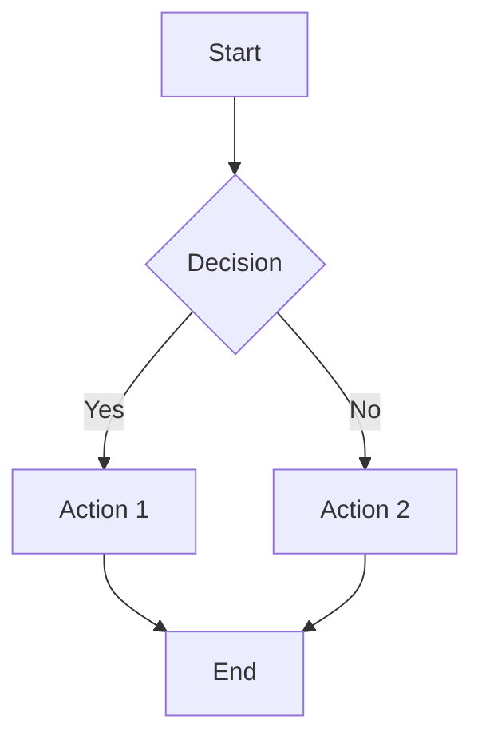
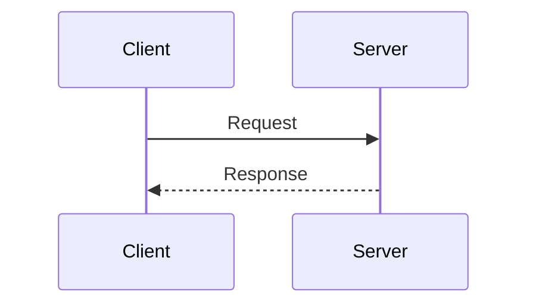
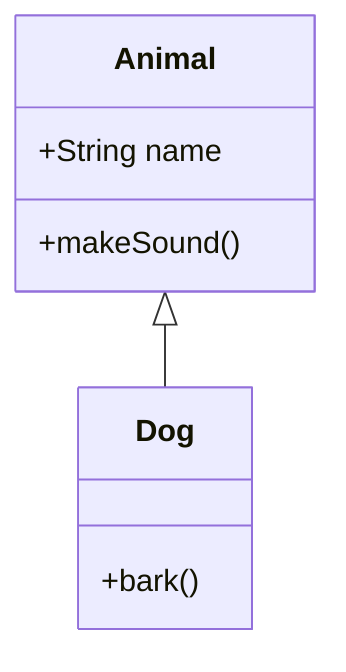
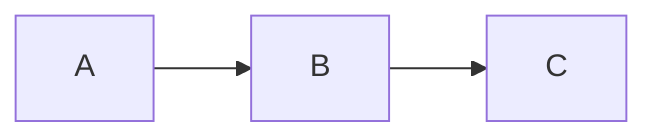

# Slidev - Presentation Framework Reference

Complete reference for creating developer education presentations with Slidev.

## Frontmatter Configuration

Every presentation starts with frontmatter in the first slide:

```yaml
---
theme: default
title: "Video Title Here"
info: |
  ## Module Description
  Brief description for metadata
author: Course Name
transition: slide-left
highlighter: shiki
drawings:
  persist: false
mdc: true
download: true
exportFilename: video-filename
aspectRatio: 16/9
canvasWidth: 980
fonts:
  sans: Inter
  mono: Fira Code
---
```

### Key Options

| Option | Purpose | Recommended |
|--------|---------|-------------|
| `theme` | Visual theme | `default`, `seriph` |
| `transition` | Slide animation | `slide-left`, `fade` |
| `highlighter` | Code syntax | `shiki` |
| `aspectRatio` | Slide ratio | `16/9` for video |
| `mdc` | MDC syntax | `true` |

---

## Slide Separators

```markdown
---          # New slide
---          # Another slide
```

Per-slide frontmatter:
```markdown
---
layout: center
class: text-center
transition: fade
---
```

---

## Built-in Layouts

### default
Standard content layout.
```markdown
---
layout: default
---
# Title
Content here
```

### center
Centered content for impact statements.
```markdown
---
layout: center
class: text-center
---
# Big Statement
```

### section
Major topic dividers.
```markdown
---
layout: section
---
# Part 1: Topic Name
```

### two-cols
Side-by-side content (code + explanation).
```markdown
---
layout: two-cols
layoutClass: gap-16
---
# Left Content

Explanation here

::right::

## Right Content

```code
example
```
```

### two-cols-header
Header spanning both columns.
```markdown
---
layout: two-cols-header
---
# Header Spans Both

::left::
Left content

::right::
Right content
```

### image-right / image-left
Image with content.
```markdown
---
layout: image-right
image: /path/to/image.jpg
backgroundSize: cover
---
# Content Side
Explanation here
```

### fact
Emphasize statistics.
```markdown
---
layout: fact
---
# 100%
Of modern C++ should use smart pointers
```

### quote
Attribution quotes.
```markdown
---
layout: quote
---
# "Quote text here"
Author Name
```

### intro
Speaker/topic introduction.
```markdown
---
layout: intro
---
# Topic Name
Introduction content
```

### end
Closing slide.
```markdown
---
layout: end
---
# Thank You
Call to action
```

---

## Code Blocks

### Basic Syntax Highlighting
````markdown
```python
def greet(name):
    return f"Hello, {name}!"
```
````

### Line Highlighting
````markdown
```python {2,4}
def calculate(x, y):
    result = x + y      # Highlighted
    print(result)
    return result       # Highlighted
```
````

### Click-Based Progressive Reveal
````markdown
```python {1|2-3|4-5|all}
def process(items):
    valid = [x for x in items if x > 0]
    sorted_items = sorted(valid)
    total = sum(sorted_items)
    return total
```
````

Pattern: `{step1|step2|step3|all}` - each `|` is a click.

### Line Numbers
````markdown
```python {lines:true}
def factorial(n):
    if n <= 1:
        return 1
    return n * factorial(n - 1)
```
````

### Custom Start Line
````markdown
```python {lines:true,startLine:42}
# Code starting at line 42
```
````

### Max Height (Scrollable)
````markdown
```python {maxHeight:'200px'}
# Long code that scrolls
```
````

### Monaco Editor (Interactive)
````markdown
```typescript {monaco}
// Editable code
const x = 5;
```
````

### Monaco Runner (Execute)
````markdown
```typescript {monaco-run}
console.log("Runs live!");
```
````

### Monaco Diff
````markdown
```typescript {monaco-diff}
// Before
function add(a, b) { return a + b; }
~~~
// After
function add(a: number, b: number): number { return a + b; }
```
````

---

## Animations & Clicks

### v-click (Single Element)
```markdown
<v-click>
This appears on click
</v-click>
```

### v-clicks (Multiple Elements)
```markdown
<v-clicks>

- First item
- Second item
- Third item

</v-clicks>
```

### Nested v-clicks
```markdown
<v-clicks depth="2">

- Parent
  - Child 1
  - Child 2
- Parent 2

</v-clicks>
```

### Click Positioning
```markdown
<div v-click="3">Appears at click 3</div>
<div v-click="1">Appears at click 1</div>
<div v-click="2">Appears at click 2</div>
```

### Hide on Click
```markdown
<div v-click.hide="3">Disappears at click 3</div>
<div v-click="[1, 3]">Visible only clicks 1-2</div>
```

### v-after (Same Click)
```markdown
<v-click>Main content</v-click>
<v-after>Appears with main content</v-after>
```

### Slide Transitions
```yaml
---
transition: slide-left  # Global default
---

---
transition: fade        # Per-slide override
---
```

Available: `slide-left`, `slide-right`, `slide-up`, `slide-down`, `fade`, `fade-out`

---

## Mermaid Diagrams

### Flowchart
````markdown

````

### Sequence Diagram
````markdown

````

### Class Diagram
````markdown

````

### Themes
````markdown

````

Themes: `default`, `neutral`, `dark`, `forest`, `base`

---

## LaTeX Math

### Inline Math
```markdown
The formula is $x = \frac{-b \pm \sqrt{b^2 - 4ac}}{2a}$
```

### Block Math
```markdown
$$
\sum_{i=1}^{n} i = \frac{n(n+1)}{2}
$$
```

### In Tables
```markdown
| Algorithm | Complexity |
|-----------|------------|
| Binary Search | $O(\log n)$ |
| Quick Sort | $O(n \log n)$ |
```

---

## Styling

### UnoCSS Utility Classes

**Layout:**
- `grid`, `flex`, `grid-cols-2`, `grid-cols-3`
- `gap-4`, `gap-8`

**Spacing:**
- `p-4`, `m-4`, `mt-8`, `px-2`, `py-1`

**Typography:**
- `text-sm`, `text-xl`, `text-2xl`
- `font-bold`, `font-mono`
- `text-center`, `text-left`

**Colors:**
- `text-blue-500`, `text-red-500`
- `bg-blue-500`, `bg-green-100`
- `bg-opacity-20`, `opacity-50`

**Borders:**
- `rounded`, `rounded-lg`
- `border`, `border-blue-500`

### Absolute Positioning
```html
<div class="abs-tr m-4">Top Right</div>
<div class="abs-tl m-4">Top Left</div>
<div class="abs-br m-4">Bottom Right</div>
<div class="abs-bl m-4">Bottom Left</div>
```

### Card Pattern
```html
<div class="p-4 rounded-lg bg-blue-500 bg-opacity-20 border border-blue-500">
Card content
</div>
```

### Scoped Styles
```markdown
<style>
h1 {
  background: linear-gradient(90deg, #667eea, #764ba2);
  -webkit-background-clip: text;
  -webkit-text-fill-color: transparent;
}
</style>
```

---

## Presenter Notes

Notes go in HTML comments at slide end:

```markdown
# Slide Title

Content here

<!--
Main talking points:
- First point to cover
- Second important concept

[click] Animation appears - explain this

[click] Next animation - elaborate

[PAUSE] Give viewers time to absorb

[TRANSITION] Lead into next topic...
-->
```

### Click Markers in Notes
```markdown
<!--
Introduction to the concept...

[click] First item appears - discuss the basics

[click] Second item - dive deeper

[click:2] Skip ahead two clicks

Final summary...
-->
```

---

## Code Groups

Show same concept in multiple languages:

````markdown
::code-group

```python [Python]
def greet(name):
    return f"Hello, {name}!"
```

```javascript [JavaScript]
function greet(name) {
    return `Hello, ${name}!`;
}
```

```rust [Rust]
fn greet(name: &str) -> String {
    format!("Hello, {}!", name)
}
```

::
````

---

## MDC Syntax

Enable with `mdc: true` in frontmatter.

### Inline Attributes
```markdown
This is [red text]{style="color:red"} inline
```

### Block Attributes
```markdown
::div{.p-4 .bg-blue-500 .bg-opacity-20 .rounded}
Block with classes
::
```

---

## Global Context

Access slide metadata:
```vue
{{ $slidev.nav.currentPage }}     <!-- Current slide -->
{{ $slidev.nav.total }}           <!-- Total slides -->
{{ $slidev.configs.title }}       <!-- Presentation title -->
```

---

## Keyboard Shortcuts

### Navigation
| Key | Action |
|-----|--------|
| `→` / `Space` | Next |
| `←` | Previous |
| `g` | Go to slide |

### Views
| Key | Action |
|-----|--------|
| `o` | Overview |
| `p` | Presenter mode |
| `f` | Fullscreen |

### Tools
| Key | Action |
|-----|--------|
| `d` | Drawings |
| `r` | Recording |

---

## Video Presentation Patterns

### Opening Hook
```markdown
---
layout: center
class: text-center
---

# Why Does Your Code Keep Crashing?

<v-click>

The answer might surprise you...

</v-click>

<!--
[HOOK] Start with a relatable problem

Pause briefly for dramatic effect.

[click] Reveal the teaser - builds curiosity
-->
```

### Concept Introduction
```markdown
---
layout: two-cols
layoutClass: gap-16
---

# Smart Pointers

<v-clicks>

- **What:** Automatic memory management
- **Why:** Prevents memory leaks
- **How:** RAII pattern

</v-clicks>

::right::

<v-click>

```cpp
auto ptr = std::make_unique<int>(42);
// Automatically freed!
```

</v-click>

<!--
[click] Define the concept clearly
[click] Explain the motivation
[click] Hint at the mechanism
[click] Show concrete example

[VISUAL CUE] Point to the code on the right
-->
```

### Code Walkthrough
```markdown
# Processing Data

```python {1|3-4|6-7|all}
# Step 1: Setup
data = [1, 2, 3, 4, 5]

# Step 2: Transform
result = [x * 2 for x in data]

# Step 3: Output
print(result)
```

<!--
[click] Show the setup - explain data structure
[click] Transform step - explain list comprehension
[click] Output - show the result
[click] Full code visible - summarize the pattern
-->
```

### Comparison Slide
```markdown
---
layout: two-cols
---

<div class="p-4 rounded bg-red-500 bg-opacity-10">

### ❌ Don't

```cpp
int* ptr = new int(42);
// Memory leak!
```

</div>

::right::

<div class="p-4 rounded bg-green-500 bg-opacity-10">

### ✔ Do

```cpp
auto ptr = make_unique<int>(42);
// Auto cleanup!
```

</div>

<!--
[SHOW CODE] Left side - the problematic pattern

Explain why this is dangerous...

[SHOW CODE] Right side - the solution

This is the modern C++ way...
-->
```

### Summary Pattern
```markdown
---
layout: center
---

# Key Takeaways

<v-clicks>

1. **Smart pointers** manage memory automatically
2. Use **unique_ptr** for single ownership
3. Use **shared_ptr** for shared ownership
4. **Never** use raw `new` in modern C++

</v-clicks>

<!--
[click] First takeaway - the main concept
[click] Second - most common case
[click] Third - when to use shared
[click] Fourth - the golden rule

[PAUSE] Let these sink in before the call to action
-->
```

### Call to Action
```markdown
---
layout: end
---

# Practice Time!

<div class="text-center mt-8">

Try converting raw pointers to smart pointers in your code

**Next Video:** Move Semantics Deep Dive

</div>

<!--
End with clear action items.

Mention the next video to encourage continued watching.

Thank viewers for watching!
-->
```

---

## Best Practices for Video

1. **16:9 aspect ratio** - Standard for video platforms
2. **Large, readable text** - Minimum 24px for body text
3. **High contrast** - Ensure readability on various screens
4. **One concept per slide** - Don't overwhelm viewers
5. **Progressive reveals** - Build understanding step by step
6. **Consistent animations** - Use same transition throughout
7. **Clear code highlighting** - Guide viewer attention
8. **Comprehensive notes** - Enable confident delivery
