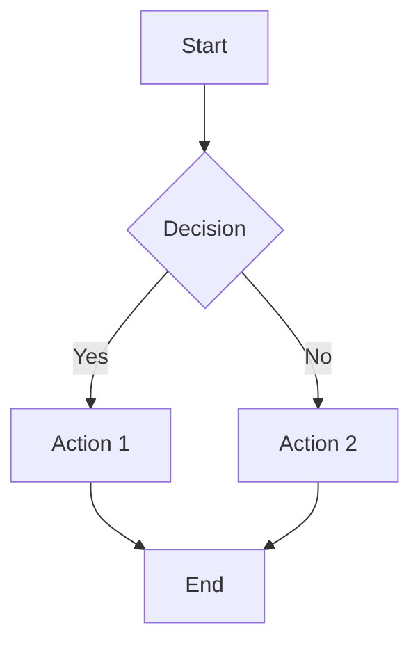
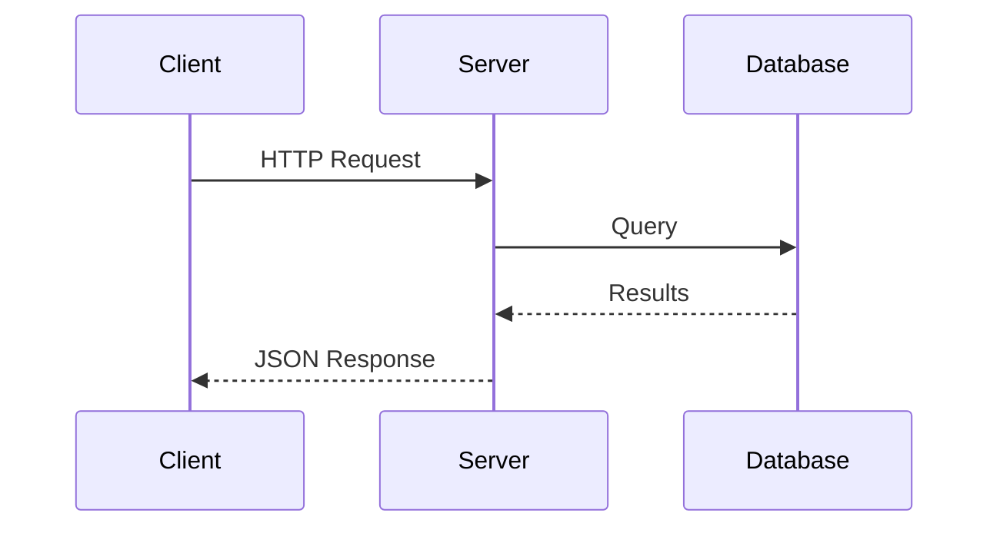
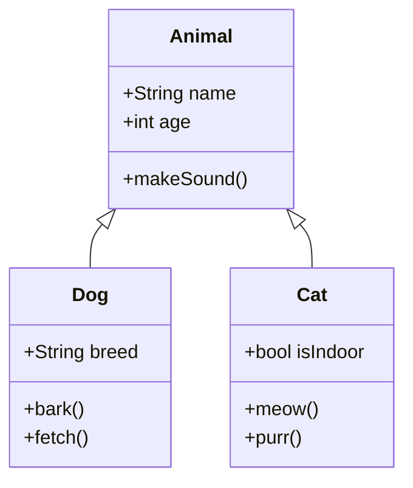
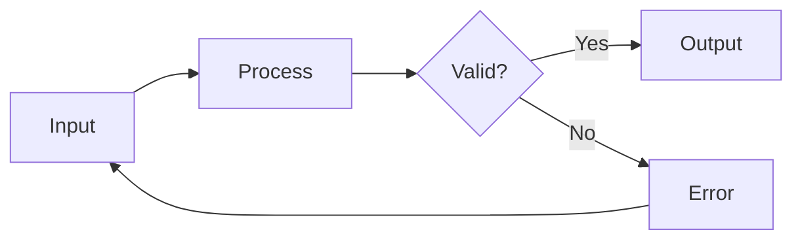

# Slidev Reference Guide

## For Developer Course Creation

<div class="pt-12">
  <span class="px-2 py-1 rounded text-sm" style="background: linear-gradient(90deg, #667eea 0%, #764ba2 100%); color: white;">
    Complete Feature Reference
  </span>
</div>

<div class="abs-br m-6 flex gap-2">
  <span class="text-sm opacity-50">Use as a template for course slides</span>
</div>

<!--
This slide deck serves as a comprehensive reference for creating developer education presentations with Slidev.

**How to use this reference:**
- Copy sections you need into your course slides
- Modify examples to fit your programming language
- Use the patterns shown for consistent course design

[click] The badge shows how to create styled inline elements
-->

---
layout: section
---

# Part 1: Frontmatter & Configuration

Essential setup for every slide deck

<!--
Frontmatter configuration is the foundation of every Slidev presentation.

The first slide's frontmatter (called "headmatter") sets global defaults for the entire deck.
-->

---

# Global Frontmatter (Headmatter)

The first slide's frontmatter configures the entire presentation:

```yaml {all|2|3-6|7-9|10-14|15-18}
---
theme: default                    # Theme name or path
title: "Course Title Here"        # Browser tab title
info: |                           # Presentation metadata
  ## Module Description
  Multi-line info about the course
author: Instructor Name           # Author info
addons:                           # Additional features
  - slidev-addon-custom
transition: slide-left            # Default slide transition
highlighter: shiki                # Code syntax highlighter
drawings:
  persist: false                  # Save drawings between sessions
mdc: true                         # Enable MDC syntax
download: true                    # Allow PDF download
exportFilename: my-slides         # Export filename
aspectRatio: 16/9                 # Slide aspect ratio
canvasWidth: 980                  # Canvas pixel width
---
```

<!--
[click] **theme** - Use 'default', 'seriph', 'apple-basic', or install custom themes

[click] **title/info** - Appears in browser tab and PDF metadata

[click] **addons** - Load extra features like code runners

[click] **transitions/highlighter** - Control animations and syntax highlighting

[click] **mdc/download** - Enable MDC syntax and PDF downloads
-->

---

# Per-Slide Frontmatter

Each slide can override global settings:

```yaml {all|2|3|4|5-6}
---
layout: two-cols               # Layout for this slide
class: text-center             # CSS classes to apply
transition: fade               # Override transition
background: /images/bg.jpg     # Background image
backgroundSize: cover          # Background sizing
---
```

<div class="grid grid-cols-2 gap-4 mt-4">

<div v-click>

### Common Properties

| Property | Purpose |
|----------|---------|
| `layout` | Slide layout |
| `class` | CSS classes |
| `background` | Background image/color |
| `transition` | Slide animation |

</div>

<div v-click>

### Layout-Specific

| Property | Used By |
|----------|---------|
| `image` | image-* layouts |
| `url` | iframe-* layouts |
| `layoutClass` | Custom layout styling |

</div>

</div>

<!--
Per-slide frontmatter lets you customize individual slides.

[click] **layout** - Changes how content is arranged on the slide

[click] The tables show common properties grouped by purpose
-->

---
layout: section
---

# Part 2: Built-in Layouts

Pre-designed slide structures

---

# Layout: default

The standard layout for content slides:

```markdown
---
layout: default
---

# Slide Title

Your content goes here with **markdown** support.

- Bullet points
- Code blocks
- Images
```

<div v-click class="mt-4 p-4 rounded bg-blue-500 bg-opacity-10">

**Best for:** General content, explanations, lists, and mixed content

</div>

<!--
The default layout is your workhorse - use it for most content slides.

[click] Best for slides that don't need special formatting
-->

---
layout: center
class: text-center
---

# Layout: center

Content is centered both horizontally and vertically

<div v-click>

Perfect for **impactful statements**, **section transitions**, or **key takeaways**

</div>

```markdown
---
layout: center
class: text-center
---
```

<!--
Center layout draws attention to important content.

[click] Use sparingly for maximum impact
-->

---
layout: intro
---

# Layout: intro

Great for introducing topics or speakers

<v-clicks>

- Name and title
- Topic overview
- Module introduction
- Speaker bio

</v-clicks>

```markdown
---
layout: intro
---
```

<!--
The intro layout is designed for introductions.

Use it at the start of modules or to introduce new speakers.
-->

---
layout: section
---

# Layout: section

## Used for major topic divisions

<!--
Section layout creates visual breaks between major topics.

The large, centered text helps students understand the presentation structure.
-->

---
layout: statement
---

# Big ideas deserve big text

<!--
Statement layout is for impactful single statements.

Use when you want to make a point that sticks with students.
-->

---
layout: fact
---

# 100%
Modern C++ applications should use smart pointers

<!--
Fact layout emphasizes statistics and key facts.

Great for memorable data points or course requirements.
-->

---
layout: quote
---

# "Any fool can write code that a computer can understand. Good programmers write code that humans can understand."

Martin Fowler

<!--
Quote layout gives proper attribution and formatting.

Use for inspiring quotes from industry experts or documentation.
-->

---
layout: two-cols
layoutClass: gap-16
---

# Layout: two-cols

Content on the left side of the slide

<v-clicks>

- First point
- Second point
- Third point

</v-clicks>

::right::

## Right Column

<div v-click>

Content on the right side

```cpp
int main() {
    return 0;
}
```

</div>

<!--
Two-column layout is essential for comparisons and code + explanation.

[click] Points appear one by one on the left

[click] Then the right column content appears
-->

---
layout: two-cols-header
---

# Layout: two-cols-header

This header spans both columns

::left::

### Left Side

- Point A
- Point B

::right::

### Right Side

- Point X
- Point Y

<!--
Two-cols-header adds a spanning header above the columns.

Useful when both columns relate to a common topic.
-->

---
layout: image-right
image: https://images.unsplash.com/photo-1516116216624-53e697fedbea?w=800
backgroundSize: cover
---

# Layout: image-right

Image on the right, content on the left

<v-clicks>

- Great for visual concepts
- Code with illustrations
- Screenshots with explanations
- Diagrams with descriptions

</v-clicks>

```markdown
---
layout: image-right
image: /path/to/image.jpg
backgroundSize: cover
---
```

<!--
Image-right layout pairs visuals with explanations.

[click] Use for concepts that benefit from visual representation
-->

---
layout: image-left
image: https://images.unsplash.com/photo-1555066931-4365d14bab8c?w=800
backgroundSize: cover
---

# Layout: image-left

Image on the left, content on the right

Perfect for:

<v-clicks>

- Architecture diagrams
- UI mockups
- Process flows
- Real-world examples

</v-clicks>

<!--
Image-left is the mirror of image-right.

[click] Choose based on visual flow and reading direction
-->

---
layout: image
image: https://images.unsplash.com/photo-1518770660439-4636190af475?w=1200
backgroundSize: cover
class: text-white
---

# Layout: image (Full Background)

<div class="absolute bottom-10 left-10 right-10 p-4 bg-black bg-opacity-50 rounded">

Full-screen background images with overlay content

```markdown
---
layout: image
image: /path/to/image.jpg
backgroundSize: cover
class: text-white
---
```

</div>

<!--
Full-screen images create visual impact.

Add semi-transparent overlays to ensure text readability.
-->

---
layout: iframe-right
url: https://sli.dev
class: my-content
---

# Layout: iframe-right

Embed live websites alongside your content

<v-clicks>

- Documentation sites
- Live demos
- Interactive tools
- Reference material

</v-clicks>

```markdown
---
layout: iframe-right
url: https://example.com
---
```

<!--
Iframe layouts embed live web content.

[click] Perfect for showing documentation or live applications
-->

---
layout: end
---

# Layout: end

## Thank you!

The ending slide for your presentation

<div class="mt-8 text-center">

**Questions?** | **Resources** | **Next Steps**

</div>

<!--
End layout provides a clean conclusion to your presentation.

Include contact info, resources, or next steps.
-->

---
layout: section
---

# Part 3: Code Blocks

The heart of developer presentations

---

# Basic Code Blocks

Standard syntax-highlighted code:

````markdown
```python
def greet(name: str) -> str:
    """Return a greeting message."""
    return f"Hello, {name}!"
```
````

Renders as:

```python
def greet(name: str) -> str:
    """Return a greeting message."""
    return f"Hello, {name}!"
```

<v-click>

Supported languages: `python`, `javascript`, `typescript`, `cpp`, `java`, `rust`, `go`, `sql`, `bash`, `html`, `css`, and many more

</v-click>

<!--
Basic code blocks use standard markdown syntax.

Shiki provides syntax highlighting for 100+ languages.

[click] Most programming languages are supported out of the box
-->

---

# Line Highlighting

Focus attention on specific lines:

````markdown
```python {2,4}
def calculate(x, y):
    result = x + y      # Line 2 highlighted
    print(f"Sum: {result}")
    return result       # Line 4 highlighted
```
````

```python {2,4}
def calculate(x, y):
    result = x + y      # Line 2 highlighted
    print(f"Sum: {result}")
    return result       # Line 4 highlighted
```

<v-click>

### Highlight Syntax

| Syntax | Effect |
|--------|--------|
| `{2}` | Single line |
| `{2,4}` | Multiple lines |
| `{2-5}` | Range of lines |
| `{2,4-6,8}` | Combined |

</v-click>

<!--
Line highlighting draws attention to specific code.

[click] Use various syntax patterns for different highlighting needs
-->

---

# Click-Based Line Highlighting

Progressive code reveal with clicks:

````markdown
```python {1|2-3|4-5|all}
def process_data(items):
    valid = [x for x in items if x > 0]
    sorted_items = sorted(valid)
    total = sum(sorted_items)
    return total
```
````

```python {1|2-3|4-5|all}
def process_data(items):
    valid = [x for x in items if x > 0]
    sorted_items = sorted(valid)
    total = sum(sorted_items)
    return total
```

<v-click at="4">

**Pattern:** `{step1|step2|step3|all}` - each `|` is a click

</v-click>

<!--
Click-based highlighting reveals code step by step.

[click] First shows the function signature
[click] Then the filtering comprehension
[click] Then the aggregation
[click] Finally shows all code together

This pattern is perfect for explaining algorithms step by step.
-->

---

# Line Numbers

Enable line numbers for reference:

````markdown
```python {lines:true}
def factorial(n):
    if n <= 1:
        return 1
    return n * factorial(n - 1)
```
````

```python {lines:true}
def factorial(n):
    if n <= 1:
        return 1
    return n * factorial(n - 1)
```

<v-click>

### Custom Starting Line

````markdown
```python {lines:true,startLine:42}
# Continues from line 42
```
````

```python {lines:true,startLine:42}
def continue_from_here():
    pass  # Line 43
```

</v-click>

<!--
Line numbers help students reference specific lines.

[click] Custom start lines are useful when showing code excerpts from larger files
-->

---

# Max Height & Scrolling

Handle long code blocks:

````markdown
```python {maxHeight:'200px'}
# Long code that will scroll
```
````

```python {maxHeight:'200px'}
class DataProcessor:
    """A comprehensive data processing class."""

    def __init__(self, config: dict):
        self.config = config
        self.data = []
        self.results = {}

    def load_data(self, source: str) -> list:
        """Load data from the specified source."""
        # Implementation here
        pass

    def process(self) -> dict:
        """Process all loaded data."""
        for item in self.data:
            result = self._transform(item)
            self._validate(result)
            self._store(result)
        return self.results

    def _transform(self, item):
        """Transform a single item."""
        pass

    def _validate(self, result):
        """Validate the transformation result."""
        pass

    def _store(self, result):
        """Store the validated result."""
        pass
```

<!--
Max height prevents long code from taking over slides.

Students can scroll to see more if needed.
-->

---

# Monaco Editor (Interactive)

Make code editable with Monaco:

````markdown
```typescript {monaco}
// Students can edit this code!
const greeting = "Hello, World!";
console.log(greeting);
```
````

```typescript {monaco}
// Students can edit this code!
const greeting = "Hello, World!";
console.log(greeting);
```

<v-click>

**Use cases:**
- Let students experiment with syntax
- Demonstrate IDE features
- Practice typing code

</v-click>

<!--
Monaco editor brings VS Code to your slides.

[click] Great for live coding demonstrations and student experimentation
-->

---

# Monaco Runner (Execute Code)

Run code directly in the presentation:

````markdown
```typescript {monaco-run}
function fibonacci(n: number): number {
    if (n <= 1) return n;
    return fibonacci(n - 1) + fibonacci(n - 2);
}
console.log(fibonacci(10));
```
````

```typescript {monaco-run}
function fibonacci(n: number): number {
    if (n <= 1) return n;
    return fibonacci(n - 1) + fibonacci(n - 2);
}
console.log(fibonacci(10));
```

<!--
Monaco runner executes JavaScript/TypeScript live.

Students can modify the code and see results immediately.

For other languages, use custom addons like slidev-addon-cpp-runner.
-->

---

# Monaco Runner Options

Control execution behavior:

````markdown
```typescript {monaco-run}{autorun:false}
// Won't run automatically - click to run
console.log("Click the play button!");
```
````

```typescript {monaco-run}{autorun:false}
// Won't run automatically - click the play button
const expensive = () => {
    let sum = 0;
    for (let i = 0; i < 1000000; i++) {
        sum += Math.sqrt(i);
    }
    return sum;
};
console.log("Result:", expensive());
```

<v-click>

| Option | Default | Description |
|--------|---------|-------------|
| `autorun` | `true` | Run on slide load |
| `maxHeight` | - | Limit output height |

</v-click>

<!--
Disable autorun for expensive computations.

[click] Options give you control over execution behavior
-->

---

# Monaco Diff Editor

Show code changes:

````markdown
```typescript {monaco-diff}
// Original version
function add(a, b) {
    return a + b;
}
~~~
// Improved version
function add(a: number, b: number): number {
    return a + b;
}
```
````

```typescript {monaco-diff}
// Original version
function add(a, b) {
    return a + b;
}
~~~
// Improved version
function add(a: number, b: number): number {
    return a + b;
}
```

<!--
Diff editor shows before/after comparisons.

Perfect for refactoring demonstrations and code reviews.
-->

---
layout: section
---

# Part 4: Animations & Clicks

Progressive content reveal

---

# v-click Directive

Show elements on click:

```markdown
<v-click>

This appears on the first click

</v-click>

<v-click>

This appears on the second click

</v-click>
```

<v-click>

This appears on the **first** click

</v-click>

<v-click>

This appears on the **second** click

</v-click>

<v-click>

This appears on the **third** click

</v-click>

<!--
v-click is the foundation of Slidev animations.

[click] First element appears
[click] Second element appears
[click] Third element appears

Use clicks to control pacing and maintain student attention.
-->

---

# v-clicks Component

Animate multiple items:

```markdown
<v-clicks>

- First item
- Second item
- Third item

</v-clicks>
```

<v-clicks>

- First item appears
- Second item appears
- Third item appears
- Fourth item appears

</v-clicks>

<!--
v-clicks wraps multiple elements for sequential reveal.

[click] through [click] Each list item appears on its own click

Much cleaner than wrapping each item individually.
-->

---

# Nested v-clicks

Control depth with the `depth` prop:

```markdown
<v-clicks depth="2">

- Parent 1
  - Child 1.1
  - Child 1.2
- Parent 2
  - Child 2.1

</v-clicks>
```

<v-clicks depth="2">

- Parent 1
  - Child 1.1
  - Child 1.2
- Parent 2
  - Child 2.1
  - Child 2.2

</v-clicks>

<!--
Depth controls how many levels of nesting get animated.

[click] First parent
[click] First child
[click] Second child
[click] Second parent
[click] continues...
-->

---

# Click Positioning

Control when elements appear:

```markdown
<div v-click="3">Appears at click 3</div>
<div v-click="1">Appears at click 1</div>
<div v-click="2">Appears at click 2</div>
```

<div class="grid grid-cols-3 gap-4 mt-8">

<div v-click="1" class="p-4 bg-green-500 bg-opacity-20 rounded">

**Click 1**

First to appear

</div>

<div v-click="2" class="p-4 bg-blue-500 bg-opacity-20 rounded">

**Click 2**

Second to appear

</div>

<div v-click="3" class="p-4 bg-purple-500 bg-opacity-20 rounded">

**Click 3**

Third to appear

</div>

</div>

<!--
Absolute click positions let you control exact timing.

[click] Green appears first
[click] Blue appears second
[click] Purple appears third

Order in markdown doesn't matter - only the click number.
-->

---

# Hide on Click

Make elements disappear:

```markdown
<div v-click.hide="2">Visible until click 2</div>
<div v-click="[1, 3]">Visible from click 1 to 3</div>
```

<div class="grid grid-cols-2 gap-8 mt-8">

<div>

### Always Visible
<div v-click.hide="3" class="p-4 bg-red-500 bg-opacity-30 rounded mt-2">

I disappear at click 3!

</div>
</div>

<div>

### Range Visibility
<div v-click="[1, 3]" class="p-4 bg-yellow-500 bg-opacity-30 rounded mt-2">

Visible clicks 1-2 only

</div>
</div>

</div>

<div v-click="3" class="mt-4 p-4 bg-green-500 bg-opacity-20 rounded text-center">

The red box is now hidden!

</div>

<!--
Hide on click removes elements from view.

[click] Yellow box appears
[click] Yellow box still visible
[click] Yellow disappears, green confirmation appears, red disappears
-->

---

# v-after Directive

Appear with the previous click:

```markdown
<div v-click>First item</div>
<div v-after>Appears WITH first item</div>
<div v-click>Second item</div>
<div v-after>Appears WITH second item</div>
```

<v-click>

**Step 1:** Main concept

</v-click>
<v-after>

Supporting detail for step 1

</v-after>

<v-click>

**Step 2:** Next concept

</v-click>
<v-after>

Supporting detail for step 2

</v-after>

<!--
v-after groups elements with the previous v-click.

[click] Step 1 and its detail appear together
[click] Step 2 and its detail appear together

Use for related content that should appear simultaneously.
-->

---

# Slide Transitions

Configure how slides animate:

```yaml
---
transition: slide-left   # Global default
---

---
transition: fade         # Per-slide override
---
```

<div class="grid grid-cols-2 gap-4 mt-4">

<v-click>

### Built-in Transitions

| Name | Effect |
|------|--------|
| `slide-left` | Slide from right |
| `slide-up` | Slide from bottom |
| `fade` | Fade in/out |
| `fade-out` | Fade out only |

</v-click>

<v-click>

### Directional

| Name | Effect |
|------|--------|
| `slide-left` | → direction |
| `slide-right` | ← direction |
| `slide-up` | ↑ direction |
| `slide-down` | ↓ direction |

</v-click>

</div>

<!--
Transitions add polish to your presentations.

[click] Built-in options cover most needs
[click] Directional variants for specific effects
-->

---
layout: section
---

# Part 5: Diagrams & Math

Visual explanations

---

# Mermaid Diagrams

Create diagrams from text:

````markdown

````


<!--
Mermaid creates diagrams from simple text syntax.

No image editing software needed - just describe the diagram.
-->

---

# Sequence Diagrams

Show interactions between components:



````markdown

````

<!--
Sequence diagrams show how components communicate.

Essential for explaining APIs, protocols, and system interactions.
-->

---

# Class Diagrams

Document object-oriented design:



<!--
Class diagrams visualize inheritance and relationships.

Perfect for OOP courses and design discussions.
-->

---

# Flowcharts with Styling

Add themes and custom scales:

````markdown

````


<v-click>

**Themes:** `default`, `neutral`, `dark`, `forest`, `base`

</v-click>

<!--
Styling options let you match diagrams to your theme.

[click] Different themes for different contexts
-->

---

# LaTeX Math

Render mathematical equations:

**Inline Math:** The quadratic formula is $x = \frac{-b \pm \sqrt{b^2 - 4ac}}{2a}$

<v-click>

**Block Math:**

$$
\sum_{i=1}^{n} i = \frac{n(n+1)}{2}
$$

</v-click>

<v-click>

**Complex Equations:**

$$
\nabla \times \vec{E} = -\frac{\partial \vec{B}}{\partial t}
$$

</v-click>

<!--
LaTeX rendering is powered by KaTeX.

[click] Block math for standalone equations
[click] Supports complex mathematical notation
-->

---

# Math in Code Courses

Useful for algorithm complexity:

<div class="grid grid-cols-2 gap-8">

<div>

### Time Complexity

| Algorithm | Complexity |
|-----------|------------|
| Binary Search | $O(\log n)$ |
| Quick Sort | $O(n \log n)$ |
| Nested Loops | $O(n^2)$ |

</div>

<div v-click>

### Space Complexity

$$
\text{Total} = O(1) + O(n) = O(n)
$$

```python
def example(n):
    result = []        # O(n) space
    for i in range(n):
        result.append(i * 2)
    return result
```

</div>

</div>

<!--
Math notation is essential for algorithm courses.

[click] Combine complexity analysis with code examples
-->

---
layout: section
---

# Part 6: Styling & CSS

Customize your slides

---

# Inline Styles

Quick styling with UnoCSS:

```html
<div class="text-2xl text-blue-500 font-bold">
  Large blue bold text
</div>

<div class="grid grid-cols-3 gap-4 mt-8">
  <div class="p-4 bg-red-100 rounded">Red</div>
  <div class="p-4 bg-green-100 rounded">Green</div>
  <div class="p-4 bg-blue-100 rounded">Blue</div>
</div>
```

<div class="text-2xl text-blue-500 font-bold">
  Large blue bold text
</div>

<div class="grid grid-cols-3 gap-4 mt-8">
  <div class="p-4 bg-red-100 rounded">Red</div>
  <div class="p-4 bg-green-100 rounded">Green</div>
  <div class="p-4 bg-blue-100 rounded">Blue</div>
</div>

<!--
UnoCSS provides utility classes for quick styling.

Familiar to Tailwind CSS users - same class names work.
-->

---

# Scoped Slide Styles

Style individual slides with `<style>`:

```markdown
# Custom Styled Slide

<style>
h1 {
  background: linear-gradient(90deg, #667eea 0%, #764ba2 100%);
  -webkit-background-clip: text;
  -webkit-text-fill-color: transparent;
}

.custom-box {
  border: 2px solid #667eea;
  padding: 1rem;
  border-radius: 0.5rem;
}
</style>
```

<style>
.custom-demo {
  border: 2px solid #667eea;
  padding: 1rem;
  border-radius: 0.5rem;
  background: linear-gradient(135deg, rgba(102,126,234,0.1) 0%, rgba(118,75,162,0.1) 100%);
}
</style>

<div class="custom-demo mt-4">
This box uses custom scoped styles
</div>

<!--
Scoped styles only affect the current slide.

Great for special formatting on individual slides.
-->

---

# Common Utility Classes

<div class="grid grid-cols-2 gap-8 text-sm">

<div>

### Layout
| Class | Effect |
|-------|--------|
| `grid` | Grid container |
| `flex` | Flexbox |
| `grid-cols-2` | 2 columns |
| `gap-4` | Gap spacing |

### Spacing
| Class | Effect |
|-------|--------|
| `p-4` | Padding |
| `m-4` | Margin |
| `mt-8` | Margin top |
| `px-2` | Horizontal padding |

</div>

<div>

### Typography
| Class | Effect |
|-------|--------|
| `text-xl` | Large text |
| `font-bold` | Bold |
| `text-center` | Center align |
| `opacity-50` | 50% opacity |

### Colors
| Class | Effect |
|-------|--------|
| `text-blue-500` | Blue text |
| `bg-red-100` | Light red bg |
| `bg-opacity-20` | 20% bg opacity |

</div>

</div>

<!--
These utility classes cover most styling needs.

Learn these patterns for consistent, professional slides.
-->

---

# Absolute Positioning

Position elements anywhere:

```html
<div class="abs-tr m-4">Top Right</div>
<div class="abs-bl m-4">Bottom Left</div>
<div class="abs-br m-4">Bottom Right</div>
```

<div class="abs-tr m-4 p-2 bg-blue-500 bg-opacity-20 rounded text-sm">
Top Right
</div>

<div class="abs-bl m-4 p-2 bg-green-500 bg-opacity-20 rounded text-sm">
Bottom Left
</div>

<div class="abs-br m-4 p-2 bg-purple-500 bg-opacity-20 rounded text-sm">
Bottom Right
</div>

<v-click>

### Position Classes

| Class | Position |
|-------|----------|
| `abs-tr` | Top right |
| `abs-tl` | Top left |
| `abs-br` | Bottom right |
| `abs-bl` | Bottom left |

</v-click>

<!--
Absolute positioning helps with slide metadata and decorations.

[click] Slidev provides shorthand classes for common positions
-->

---

# Cards and Containers

Create visual groupings:

<div class="grid grid-cols-3 gap-4">

<div v-click class="p-4 rounded-lg bg-blue-500 bg-opacity-20 border border-blue-500">

### Concept 1

Key information about this concept

</div>

<div v-click class="p-4 rounded-lg bg-green-500 bg-opacity-20 border border-green-500">

### Concept 2

Related information here

</div>

<div v-click class="p-4 rounded-lg bg-purple-500 bg-opacity-20 border border-purple-500">

### Concept 3

Final concept details

</div>

</div>

```html
<div class="p-4 rounded-lg bg-blue-500 bg-opacity-20
            border border-blue-500">
  Content here
</div>
```

<!--
Cards group related content visually.

[click] First concept
[click] Second concept
[click] Third concept

Use consistent styling across your course for professional appearance.
-->

---
layout: section
---

# Part 7: Presenter Notes

Behind-the-scenes guidance

---

# Writing Presenter Notes

Add notes with HTML comments at slide end:

```markdown
# Slide Title

Content here...

<!--
These are presenter notes!

**Key points to cover:**
- First important point
- Second important point

[click] Explain what happens at this click
[click] Explain the next click

Ask the audience: "What do you think happens next?"
-->
```

<div v-click class="mt-4 p-4 bg-yellow-500 bg-opacity-20 rounded">

**Access notes:** Press `p` in presentation mode to open presenter view

</div>

<!--
This is an example of presenter notes!

**Teaching tips:**
- Make eye contact with students
- Pause for questions after key concepts
- Check for understanding before moving on

[click] Mention the keyboard shortcut to access presenter view
-->

---

# Click Markers in Notes

Sync notes with slide animations:

```markdown
<!--
Introduction to the topic...

[click] Now the first item appears - explain the concept

[click] Second item - dive deeper into details

[click:2] Skip two clicks worth of content

Final summary points...
-->
```

<v-clicks>

- First concept appears
- Second concept follows
- Third concept
- Fourth concept

</v-clicks>

<!--
This demonstrates click markers in presenter notes.

[click] First item: Explain the foundational concept

[click] Second item: Build on the previous point

[click] Third item: Show the relationship

[click] Fourth item: Summarize the pattern
-->

---

# Note-Taking Best Practices

<div class="grid grid-cols-2 gap-8">

<div v-click>

### Do Include

- Key talking points
- Questions to ask students
- Timing reminders
- Click explanations
- Transition phrases
- Common misconceptions

</div>

<div v-click>

### Avoid

- Reading slide content verbatim
- Too much detail
- Exact scripts (be natural)
- Missing click markers
- Unexplained animations

</div>

</div>

<v-click>

<div class="mt-4 p-4 bg-blue-500 bg-opacity-20 rounded">

**Pro tip:** Write notes as if explaining to another instructor who will teach this material

</div>

</v-click>

<!--
[click] **Include** - These elements help you deliver the content effectively

[click] **Avoid** - These make notes less useful

[click] The "other instructor" mindset ensures completeness without over-scripting
-->

---
layout: section
---

# Part 8: Advanced Features

Power user techniques

---

# MDC Syntax

Enable with `mdc: true` in frontmatter:

```markdown
This is [red text]{style="color:red"} inline styling

::div{.custom-class}
Block with custom class
::
```

<div v-click>

This is [red text]{style="color:red"} with MDC inline styling

</div>

<v-click>

::div{.p-4 .bg-green-500 .bg-opacity-20 .rounded .mt-4}
This block has MDC-applied classes
::

</v-click>

<!--
MDC (Markdown Components) adds powerful inline syntax.

[click] Inline attributes for quick styling
[click] Block-level custom styling
-->

---

# Code Groups

Group related code blocks:

::code-group

```python [Python]
def greet(name):
    return f"Hello, {name}!"
```

```javascript [JavaScript]
function greet(name) {
    return `Hello, ${name}!`;
}
```

```rust [Rust]
fn greet(name: &str) -> String {
    format!("Hello, {}!", name)
}
```

::

<v-click>

```markdown
::code-group

```python [Python]
# Python code
```

```javascript [JavaScript]
// JavaScript code
```

::
```

</v-click>

<!--
Code groups show the same concept in multiple languages.

[click] Syntax for creating code groups

Perfect for polyglot courses or language comparisons.
-->

---

# Custom Components

Create reusable Vue components:

```vue
<!-- components/Callout.vue -->
<template>
  <div class="callout" :class="type">
    <slot />
  </div>
</template>

<script setup>
defineProps(['type'])
</script>
```

<div class="p-4 bg-yellow-500 bg-opacity-20 border-l-4 border-yellow-500 rounded mt-4">

⚠️ **Warning:** This is a custom callout component

</div>

<div class="p-4 bg-blue-500 bg-opacity-20 border-l-4 border-blue-500 rounded mt-4">

💡 **Tip:** Components live in the `components/` directory

</div>

<!--
Custom components extend Slidev's functionality.

Create callouts, special layouts, or interactive elements.
-->

---

# Global Context Access

Access slide metadata in templates:

```vue
<!-- Available in any slide -->
{{ $slidev.nav.currentPage }}     <!-- Current slide number -->
{{ $slidev.nav.total }}           <!-- Total slides -->
{{ $slidev.configs.title }}       <!-- Presentation title -->
{{ $slidev.themeConfigs.primary }} <!-- Theme settings -->
```

<div class="mt-8 p-4 bg-gray-500 bg-opacity-20 rounded">

**Current slide:** {{ $slidev.nav.currentPage }} of {{ $slidev.nav.total }}

**Title:** {{ $slidev.configs.title }}

</div>

<!--
Global context provides dynamic access to presentation state.

Useful for footers, progress indicators, and conditional content.
-->

---

# Keyboard Shortcuts

Essential shortcuts for presenting:

<div class="grid grid-cols-2 gap-8 text-sm">

<div>

### Navigation
| Key | Action |
|-----|--------|
| `→` / `Space` | Next slide/click |
| `←` | Previous slide |
| `↑` / `↓` | Previous/next slide |
| `g` | Go to slide |

### Tools
| Key | Action |
|-----|--------|
| `d` | Toggle drawings |
| `h` | Toggle handwriting |
| `c` | Toggle cursor |

</div>

<div>

### Views
| Key | Action |
|-----|--------|
| `o` | Overview mode |
| `p` | Presenter mode |
| `f` | Fullscreen |
| `Esc` | Exit mode |

### Recording
| Key | Action |
|-----|--------|
| `r` | Toggle recording |
| `s` | Take screenshot |

</div>

</div>

<!--
Learn these shortcuts for smooth presentations.

Practice navigation before presenting to students.
-->

---
layout: section
---

# Part 9: Templates & Patterns

Reusable slide structures

---

# Pattern: Concept Introduction

<div class="grid grid-cols-5 gap-4">

<div class="col-span-3">

## [Concept Name]

<v-clicks>

- **What:** Brief definition
- **Why:** When and why to use it
- **How:** Basic syntax/usage

</v-clicks>

<v-click>

```python
# Example code showing the concept
example_code_here()
```

</v-click>

</div>

<div class="col-span-2" v-click>

### Quick Reference

| Property | Value |
|----------|-------|
| Type | Category |
| Complexity | O(n) |
| Use when | Condition |

</div>

</div>

<!--
Pattern for introducing new concepts:

[click] What - Define the concept clearly
[click] Why - Explain its purpose
[click] How - Show basic usage
[click] Example - Concrete code
[click] Reference - Quick lookup table

Use this structure for consistency across your course.
-->

---

# Pattern: Code Walkthrough

```python {1|3-4|6-8|all}
# Step 1: Setup
data = [1, 2, 3, 4, 5]

# Step 2: Process
result = []
for item in data:
    result.append(item * 2)

# Step 3: Output
print(result)  # [2, 4, 6, 8, 10]
```

<div v-click="4" class="mt-4">

### What We Learned

1. Data preparation
2. Iteration pattern
3. Result collection

</div>

<!--
Code walkthrough pattern:

[click] Show setup - explain initial state
[click] Show processing - explain the algorithm
[click] Show output - explain the result
[click] Summary appears after full code is shown
-->

---

# Pattern: Comparison Slide

<div class="grid grid-cols-2 gap-8">

<div v-click class="p-4 rounded bg-red-500 bg-opacity-10">

### ❌ Bad Practice

```python
# Don't do this
data = []
for i in range(100):
    data = data + [i]  # Creates new list each time!
```

**Problems:**
- O(n²) complexity
- Excessive memory allocation
- Poor performance

</div>

<div v-click class="p-4 rounded bg-green-500 bg-opacity-10">

### ✔ Best Practice

```python
# Do this instead
data = []
for i in range(100):
    data.append(i)  # Modifies in place
```

**Benefits:**
- O(n) complexity
- Efficient memory use
- Fast execution

</div>

</div>

<!--
Comparison pattern for teaching best practices:

[click] Show the bad example first - explain why it's problematic
[click] Show the good example - explain the improvements

This side-by-side format makes differences clear.
-->

---

# Pattern: Summary Slide

<div class="grid grid-cols-2 gap-8">

<div>

## Key Takeaways

<v-clicks>

1. **First concept** - Brief reminder
2. **Second concept** - Key point
3. **Third concept** - Important detail
4. **Fourth concept** - Final emphasis

</v-clicks>

</div>

<div v-click>

## Quick Reference

```python
# Pattern to remember
concept_1()
concept_2()
concept_3()
```

### Next Steps

- Practice exercise
- Reading assignment
- Next module preview

</div>

</div>

<!--
Summary pattern for module endings:

[click] through [click] Key takeaways appear one by one

[click] Quick reference and next steps appear together

Always end with actionable next steps for students.
-->

---

# Pattern: Exercise Introduction

## Exercise: [Exercise Name]

<div class="grid grid-cols-2 gap-8 mt-4">

<div>

### Requirements

<v-clicks>

- [ ] Requirement 1
- [ ] Requirement 2
- [ ] Requirement 3
- [ ] Bonus: Extra challenge

</v-clicks>

</div>

<div v-click>

### Starter Code

```python
def solve(data):
    """
    Your implementation here.

    Args:
        data: Input data

    Returns:
        Processed result
    """
    pass
```

</div>

</div>

<v-click>

<div class="mt-4 p-4 bg-yellow-500 bg-opacity-20 rounded">

**Hints:** Consider using [technique] and remember [concept]

</div>

</v-click>

<!--
Exercise introduction pattern:

[click] through [click] Requirements appear one by one

[click] Starter code appears

[click] Hints appear last

Gradual reveal prevents students from jumping ahead.
-->

---
layout: center
class: text-center
---

# Start Building Your Course!

Use these patterns as your foundation

<div class="mt-8">

**Resources**

[Slidev Documentation](https://sli.dev) | [UnoCSS](https://unocss.dev) | [Mermaid](https://mermaid.js.org)

</div>

<div class="abs-br m-6">
  <span class="text-sm opacity-50">Slidev Reference Guide</span>
</div>

<!--
Final slide - remind students of available resources.

This reference guide can be copied and modified for any developer course.

Good luck with your course creation!
-->

---
layout: end
---

# Reference Complete

<div class="text-center mt-8">

Copy sections you need into your course slides

Modify examples for your programming language

Maintain consistent patterns throughout

</div>

<!--
End of reference guide.

**Next steps:**
1. Copy this file as a starting point
2. Replace examples with your language/topic
3. Build your course module by module
4. Test presenter mode before teaching
-->
